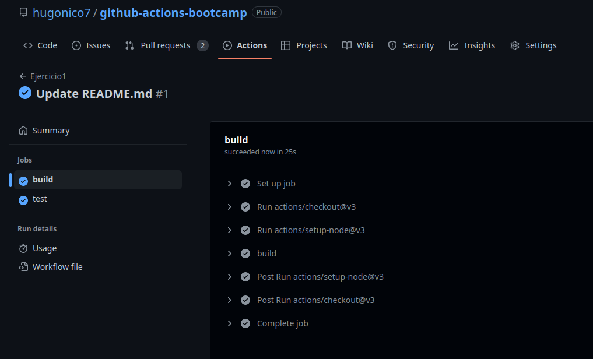
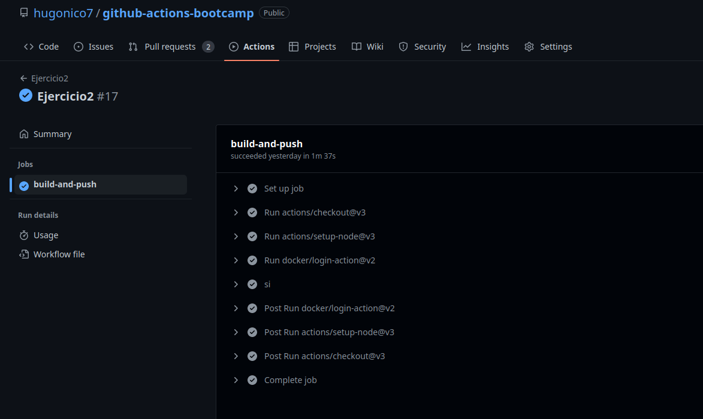
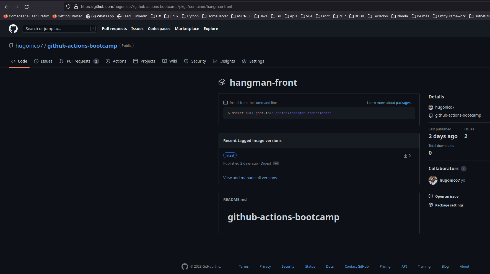

# Ejercicios Github Actions

---

## Ejercicio 1

---

Para el ejercicio me he creado un [repositorio](https://github.com/hugonico7/github-actions-bootcamp/).

Para hacer el ejercicio, contiene el Workflow del primer ejercicio.

```yaml
name: Ejercicio1

on:
  pull_request:
    branches:
      - "main"

jobs:
  build:
    runs-on: ubuntu-latest
    steps:
      - uses: actions/checkout@v3
      - uses: actions/setup-node@v3 
        with:
          node-version: 16
      - name: build
        run: |
          npm ci 
          npm run build --if-present
          

  test:
    runs-on: ubuntu-latest
    steps:
      - uses: actions/checkout@v3
      - uses: actions/setup-node@v3 
        with:
          node-version: 16
      - name: test
        run: |
          npm ci
          npm test 
```



Para hacer el ejercicio, contiene el Workflow del segundo ejercicio.

```yaml
name: Ejercicio2

on:
  workflow_dispatch:
    inputs:
      image_name:
        description: 'Nombre de la imagen:'
        required: true

jobs:
  build-and-push:
    runs-on: ubuntu-latest

    steps:
      - uses: actions/checkout@v3
      - uses: actions/setup-node@v3
      - uses: docker/login-action@v2
        with:
          registry: ghcr.io
          username: ${{ github.actor }}
          password: ${{ secrets.GITHUB_TOKEN }}
      - name: si
        run: |
          npm ci 
          npm run build --if-present
          docker build -t "${{ inputs.image_name }}" .
          docker push ${{ inputs.image_name }}
```




